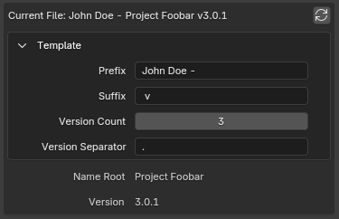
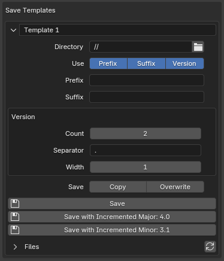

# Advanced Save Incremental - Blender Add-on

This add-on intends to be an advanced version of the default "Save Incremental" feature. With "Advanced Save Incremental" you
can save a file with multiple numerical version parts separated by a customizable string.

## usage

### current file parameters

file name _stem_ - part of the file path without its extension and directory path [[wiki]][stem]. often also called a
_base name_. in this add-on a less common "stem" term is used instead of "base name", because in the context of Blender
Python API it makes more sense (`basename` code name is not _stem_, and we would like to eliminate the confusion).

filename stem is divided into _Prefix_, _Root_, _Suffix_ and _Version_ in this order.

for example, if the file name looks like "John Doe - Project Foobar v3.0.1.blend", its stem can be separated into
logical parts like:

- "John Doe" - a name of the author, e.g. when a team has a repository where it's required to separate the ownership
- "Project Foobar" - a name of the project
- "3.0.1" - a numerical version

such name would be defined in the add-on as a _Save Template_ with the following parameters:

- _Prefix_ = "John Doe - "
- _Suffix_ = " v"
- _Version_ would have own parameters:
    - _Count_ = 3
    - _Separator_ = "."

_Root_ parameter and _Version_ value will be auto-detected:

- _Root_ = "Project Foobar"
- _Version_ = "3.0.1"

[stem]: https://en.wikipedia.org/wiki/Filename#Filename_extensions

### _Save Templates_ parameters and operators

_Save Template_ - is a set of settings for how to save the new file:

- _Name_ (the unlabeled property in the header) - only for logical separation
- _Directory_ - a typical directory path property. see [File Paths][File Paths] in the Blender Manual for details
- _Use Prefix/Suffix/Version_ parameters are toggles which control which parts to include in the final result
- _Prefix_/_Suffix_ - similar to the _Current File_ parameters, these are just simple strings, which can be same as in
  the _Current File_, different or empty
- _Version_ has _Count_ and _Separator_ as described before and a new parameter _Width_. when _Width_ is larger than 1,
  version numbers which are composted of more than 1 digit will be prepended with zeroes, e.g. version "3.0.10" with
  width 3 will become "003.000.010". this schema is often used when you want to have file names ordered correctly by
  numerical version in primitive file explorers
- _Save Copy_ option makes Save operators behave like native Blender "Save Copy" operator
- _Save Overwrite_ option doesn't warn you about overwriting an existing file

as a bonus, you can also see and open the _Directory_ files directly from the panel

[File Paths]: https://docs.blender.org/manual/en/latest/editors/preferences/file_paths.html

## design details

### user interface

logically, as features of this add-on do not fit into any existing [Editor][Editor], it would be best to create
a new one for this add-on but unfortunately as for Blender 4.2 this is not possible, so the UI is placed in the Sidebar
of 3D Viewport, as the most generic and common place.

from forums and different documentations it seems the need for custom Editor spaces exists at least from 2019, but not
implemented as for the moment of this add-on's release.

some discussions:

- from forums :
    - [Developing a New Editor](https://devtalk.blender.org/t/developing-a-new-editor/894/20)
    - [Is it possible to create a new editor (area) with python api?](https://devtalk.blender.org/t/is-it-possible-to-create-a-new-editor-area-with-python-api/17605)
    - [Blender 2.8 UI panel location for a complex add-on](https://devtalk.blender.org/t/blender-2-8-ui-panel-location-for-a-complex-add-on/5420)
- from Stack Exchange :
    - unanswered https://blender.stackexchange.com/questions/185254/how-to-create-custom-editors-with-python
    - unanswered https://blender.stackexchange.com/questions/240618/can-i-create-my-own-area-in-blender

### data storage

it's common to save file-specific data in the first Scene object. this add-on adds data that is not supposed to be
edited by the user in a direct way, so we add the custom properties to the Text datablock which as a bonus does not
expose the Custom Properties user interface.

see also: https://blender.stackexchange.com/questions/8290/how-to-register-global-i-e-unique-per-file-properties

## technical details

### bpy.props

the API requires defining Custom Properties as annotations, which breaks the code style, which relies on Python typings.
if a custom property is defined like `p: bpy.props...` then it breaks static type checkers and detects dynamic usages
everywhere, which also slows down refactorings. let's say we have a `split` method defined anywhere in the code at any
level (module, class, doesn't matter) not related to `str.split` in any way. when we access our `p` property it's type
will be detected as `None` because Blender does not provide normal Python module to rely on and `fake-bpy-module` does
not extract the correct annotations for each of the `bpy.props.*`. so until Blender finally makes the normal module to
use, we define getters like `p_get(self) -> ...` with the correct typing where needed.

### code legacy

there are some code design issue left because of how the add-on quickly changed the requirements during the development.
the list by top-priority:

- operator data is built on every `draw` call, which was fine for the first version, but with the dynamic collection
  of Save Templates, the code become messy. now `core` logic is mixed with Blender interface logic and it should be
  separated.
- `config` in `VersionTemplate` class is temporary, the values should be simply part of class validation.
- `bpyx` can be re-organized better
- it would likely be nicer to have `draw_*` methods inside a property groups, but currently there is no need for it
- `data_*` accessors and modifiers could have fewer parameters, as all the extra data is in `Preferences`. legacy code
- when defining `Callable` typings, `ParamSpec` can be useful instead, but for now we use a simple way

[Editor]: https://docs.blender.org/manual/en/4.2/editors/index.html

