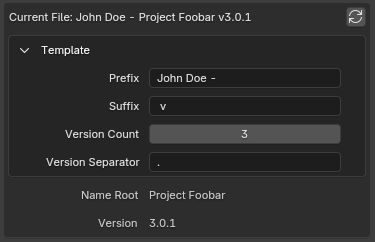
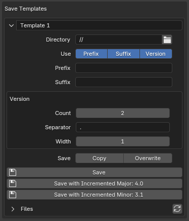

# Advanced Save Incremental - Blender Add-on

This add-on intends to be an advanced version of the default "Save Incremental" feature. With "Advanced Save
Incremental" you can save a file with multiple numerical version parts separated by a customizable string.

## usage

### current file parameters

file name [_stem_][stem] - also known as a _base name_, a part of the file path without its extension and directory
path.

filename stem is divided into _Prefix_, _Root_, _Suffix_ and _Version_ in this order.

for example, if the file name looks like "John Doe - Project Foobar v3.0.1.blend", its stem can be separated into
logical parts like:

- "John Doe" - a name of the author, e.g. when a team has a repository where it's required to separate the ownership
- "Project Foobar" - a name of the project
- "3.0.1" - a numerical version

such a name would be defined in the add-on as a _Save Template_ with the following parameters:

- _Prefix_ = "John Doe - "
- _Suffix_ = " v"
- _Version_ would have own parameters:
    - _Count_ = 3
    - _Separator_ = "."

_Root_ parameter and _Version_ value will be auto-detected:

- _Root_ = "Project Foobar"
- _Version_ = "3.0.1"

[stem]: https://en.wikipedia.org/wiki/Filename#Filename_extensions

### _Save Templates_ parameters and operators

_Save Template_ - is a set of settings for how to save the new file:

- _Name_ (the unlabeled property in the header) - only for logical separation
- _Directory_ - a typical directory path property. see [File Paths][File Paths] in the Blender Manual for details
- _Use Prefix/Suffix/Version_ parameters are toggles which control which parts to include in the final result
- _Prefix_/_Suffix_ - similar to the _Current File_ parameters, these are just simple strings, which can be the same as
  in the _Current File_, different or empty
- _Version_ has _Count_ and _Separator_ as described before and a new parameter _Width_. when _Width_ is larger than 1,
  version numbers which are composed of more than 1 digit will be prepended with zeroes, e.g. version "3.0.10" with
  width 3 will become "003.000.010". this schema is often used when you want to have file names ordered correctly by
  numerical version in primitive file explorers
- _Save Copy_ option makes Save operators behave like native Blender "Save Copy" operator
- _Save Overwrite_ option doesn't warn you about overwriting an existing file

as a bonus, you can also see and open the _Directory_ files directly from the panel

[File Paths]: https://docs.blender.org/manual/en/latest/editors/preferences/file_paths.html
